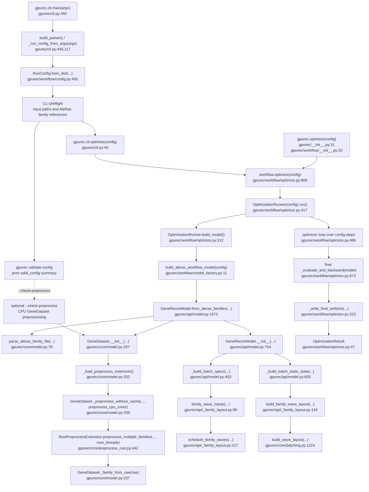
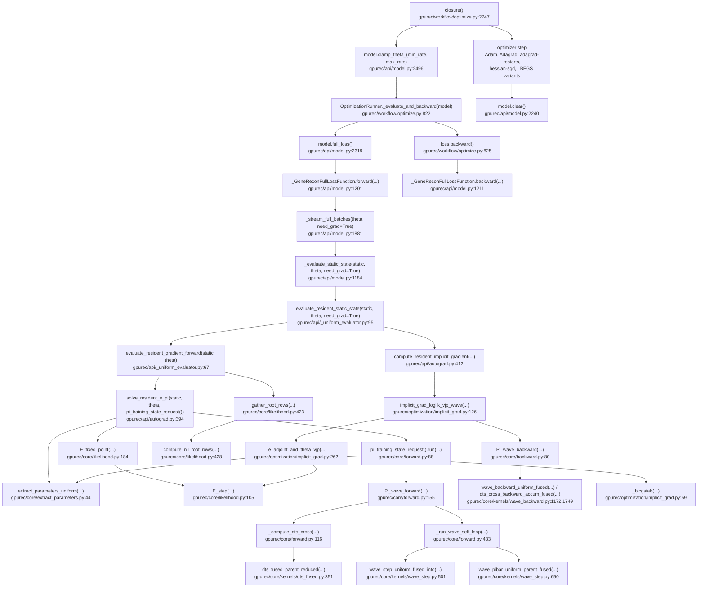

# gpurec Optimization Workflow Call Graph

Scope: this follows the supported production path used by `gpurec
validate-config`, `gpurec optimize`, `gpurec run`, and the equivalent Python
API call `gpurec.optimize(RunConfig)`. It covers CPU-safe config preflight,
AleRax-style dataset processing, likelihood optimization, and final artifact
publication. `gpurec run` calls the same optimization path first, then continues
into sampling.

## End-To-End Workflow

`gpurec validate-config` stops at the preflight node by default. It validates
the flat JSON/CLI `RunConfig`, required paths, selected AleRax family records,
mapping files, and referenced gene-tree files without constructing
`GeneReconModel`, loading the Rust preprocessing extension, or touching CUDA.
With `--check-preprocess`, `validate-config` additionally runs CPU
`GeneDataset` preprocessing for the selected families; that optional path loads
the retained Rust parser and catches Newick or mapping errors before
optimization, then reports whether the preprocessed species-node count passes
the retained CUDA backward `S > 256` gate. It still does not construct the CUDA
likelihood model. `gpurec optimize` and `gpurec run` use the default lightweight
preflight before
entering the CUDA likelihood workflow. The Python API starts at
`workflow.optimize(config)` and therefore skips only the CLI parser/preflight
layer.

`--require-cuda-backward-ready` makes the `--check-preprocess` readiness report
a hard CLI gate. It is intended for production launch checks and still runs
entirely on CPU.

## Per-Step Likelihood And Gradient

This is the work done by each optimizer closure. The workflow model is built
with `lazy_preprocess=True`, so `full_loss()` uses the full-batch streaming
autograd bridge.

## Outputs And Checkpoints

```mermaid
flowchart TD
  StepRow["per-step metrics row<br/>gpurec/workflow/optimize.py:570"]
  Record["_record(row)<br/>gpurec/workflow/optimize.py:354"]
  Append["append_jsonl(history.jsonl, row)<br/>gpurec/workflow/diagnostics.py:163"]
  SaveStatus["_save_status(... latest.pt / best.pt)<br/>gpurec/workflow/optimize.py:393"]
  SaveCheckpoint["save_checkpoint(...)<br/>gpurec/workflow/checkpoint.py:122"]

  FinalArtifacts["_write_final_artifacts(...)<br/>gpurec/workflow/optimize.py:223"]
  Stage["create_artifact_temp_dir(...)<br/>gpurec/workflow/_artifact_publish.py:13"]
  History["_write_history_jsonl_with_final_row(...)<br/>gpurec/workflow/optimize.py:182"]
  Rates["_write_rate_table(rates_final.tsv, ...)<br/>gpurec/workflow/optimize.py:140"]
  PerFamily["_write_per_family_likelihoods(per_fam_likelihoods.tsv, ...)<br/>gpurec/workflow/optimize.py:174"]
  PerFamilyNLL["model.full_nll_per_family()<br/>gpurec/api/model.py:1693"]
  Theta["torch.save(model.theta, theta_final.pt)<br/>gpurec/workflow/optimize.py:262"]
  CSV["write_csv(optimization_history.csv, history)<br/>gpurec/workflow/diagnostics.py:169"]
  Summary["write_json_strict(summary.json, summary)<br/>gpurec/workflow/diagnostics.py:39"]
  Publish["_publish_final_artifacts(...)<br/>gpurec/workflow/optimize.py:210"]
  AtomicPublish["publish_staged_artifacts(...)<br/>gpurec/workflow/_artifact_publish.py:68"]
  OutDir["output directory<br/>history.jsonl, optimization_history.csv,<br/>rates_final.tsv, theta_final.pt, summary.json,<br/>checkpoints/latest.pt, checkpoints/best.pt,<br/>per_fam_likelihoods.tsv in genewise mode"]

  StepRow --> Record --> Append
  StepRow --> SaveStatus --> SaveCheckpoint
  FinalArtifacts --> Stage
  FinalArtifacts --> History
  FinalArtifacts --> Rates
  FinalArtifacts --> PerFamily --> PerFamilyNLL
  FinalArtifacts --> Theta
  FinalArtifacts --> CSV
  FinalArtifacts --> Summary
  FinalArtifacts --> Publish --> AtomicPublish --> OutDir
  SaveCheckpoint --> OutDir
```

## Notes

- `optimizer=auto` resolves to `hessian-sgd` for `mode=genewise`,
  `adagrad-restarts` for `mode=specieswise`, and `adam` for `mode=global`.
- The workflow optimizer phases are selected in
  `OptimizationRunner._phase_for_step()` and built in `_make_optimizer()`.
- `adagrad-restarts` is specieswise-only. Each schedule phase reconfigures
  `fixed_iters_E`, `fixed_iters_Pi`, and `neumann_terms` to the phase budget,
  resets Adagrad state, records `optimizer/adagrad_restart_*` fields, and uses
  `adagrad_restart_total_steps` as the schedule-derived optimizer cap.
  Route metadata reports the resulting `optimizer_step_cap` and
  `optimizer_step_cap_reason` alongside `configured_steps`, and uses
  `adagrad_restart_final_check_iters` for the final high-fidelity evaluation.
- `hessian-sgd` is genewise-only. It works on active resident batches, uses
  warmup solver budgets before the full stage, refreshes row-wise 3x3
  finite-difference Hessians, applies BFGS row updates between refreshes, and
  records projected gradients for rate-bound-aware stopping.
- Adam and Adagrad evaluate once before the parameter update. LBFGS-style
  optimizers use loss-only probes where supported, then record one accepted
  current-theta gradient evaluation.
- The direct `UniformChunkedReconModel` path has its own public surface in `gpurec/api/uniform_chunked.py`, but the production workflow above currently constructs `GeneReconModel`.
