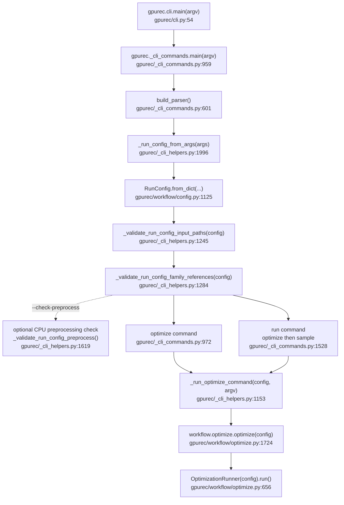
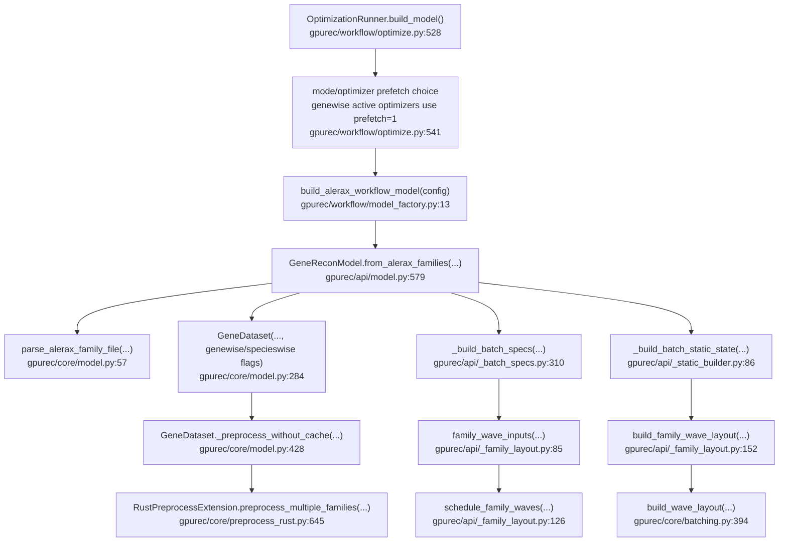
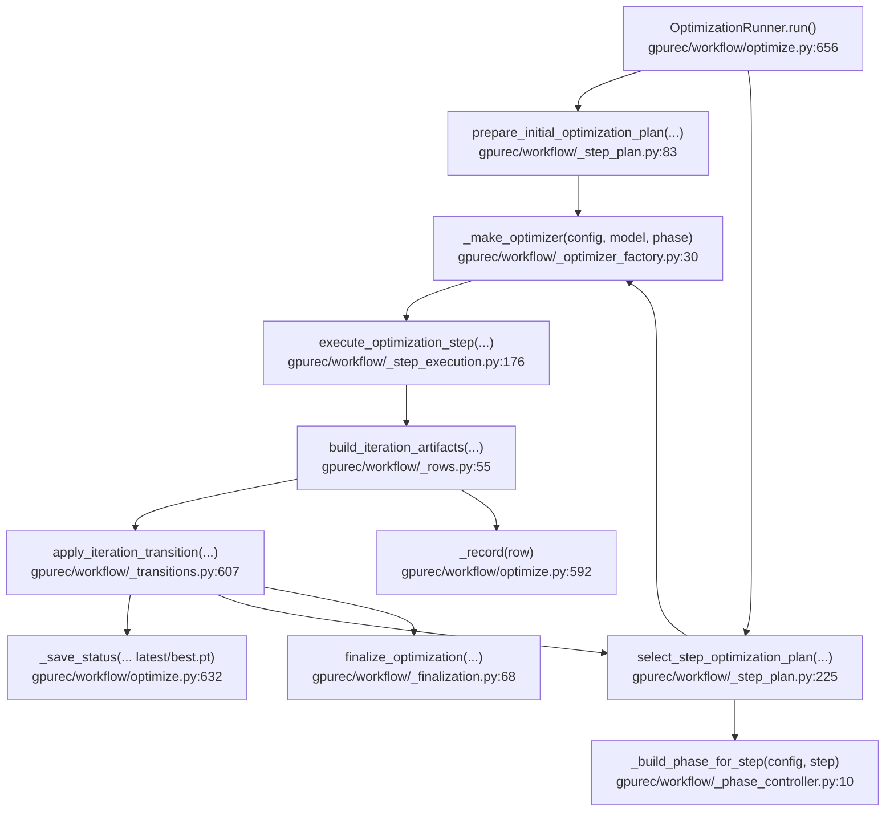
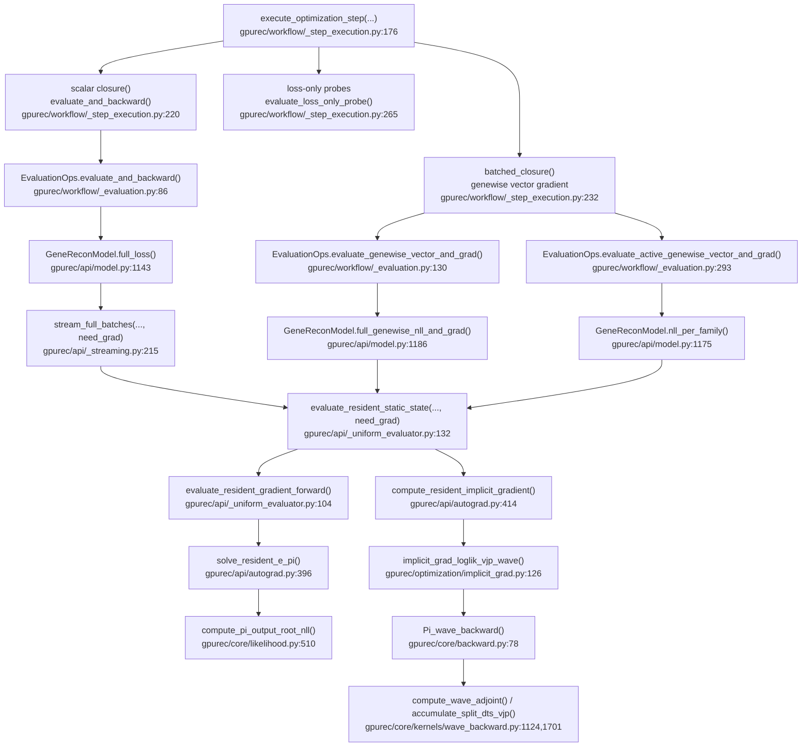
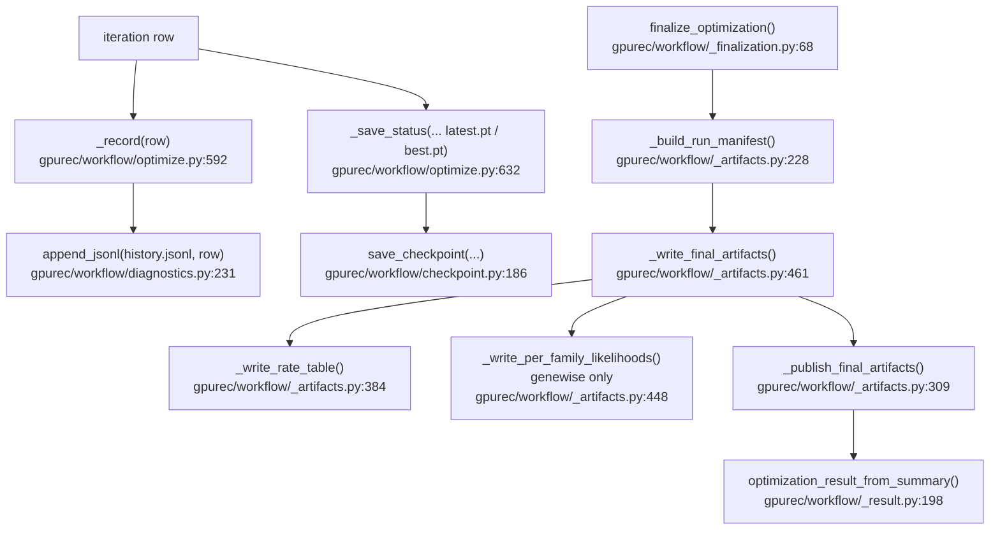

# gpurec Optimization Workflow Call Graph

Scope: this maps the current production workflow entry points after the CLI,
API, and workflow split. It covers `gpurec validate-config`, `gpurec optimize`,
`gpurec run`, and the Python call `gpurec.workflow.optimize.optimize(config)`.
The supported workflow modes are `genewise`, `specieswise`, and
`global`. In this document, "uniform" means the shared-theta global route
(`mode=global`) unless the direct `UniformChunkedReconModel` API is named
explicitly.

## Entry Points

`gpurec validate-config` stops at the preflight node after config/path/family
validation by default. With `--check-preprocess`, it runs CPU `GeneDataset`
preprocessing through `_build_cpu_preprocess_dataset()`
(`gpurec/_cli_helpers.py:1498`), loads the retained Rust parser, and reports
whether the species-node count passes the retained CUDA backward `S > 256`
gate. `--require-cuda-backward-ready` makes that report a hard CLI gate. This
path runs without constructing `GeneReconModel`, loading the Rust preprocessing
extension for CUDA model construction, or touching CUDA; it validates parser and
mapping readiness before the optimization path.
In older release-gate wording, it runs without constructing `GeneReconModel`,
loading the Rust preprocessing extension, or touching CUDA.

## Mode Routing

| Mode | Theta shape | `optimizer=auto` | Main workflow branch |
| --- | --- | --- | --- |
| `genewise` | `[families, 3]` | `hessian-sgd` | Active resident batches, per-family vector loss/gradient, finite-difference Hessian row updates. |
| `specieswise` | `[species, 3]` | `adagrad-restarts` | Shared full-model closure with specieswise Adagrad restart phases and final high-budget check. |
| `global` | `[3]` | `adam` | Shared-theta uniform route through the scalar full-loss closure. |

The source of truth for defaults is
`MODE_DEFAULT_OPTIMIZERS` (`gpurec/workflow/config.py:36`). Mode validation and
optimizer compatibility live in `RunConfig` (`gpurec/workflow/config.py:915`
and `gpurec/workflow/config.py:991`).

`optimizer=auto` resolves to `hessian-sgd` for `mode=genewise`,
`adagrad-restarts` for `mode=specieswise`, and `adam` for `mode=global`.
`hessian-sgd` is genewise-only. `adagrad-restarts` is specieswise-only.
`adagrad-restarts-lbfgsb` is specieswise-only.

## Model Build

`OptimizationRunner.build_model()` also applies the first
`adagrad-restarts` phase budgets before model construction
(`gpurec/workflow/optimize.py:531`) so specieswise restart runs start with the
phase solver settings already installed.

## Iteration Loop

The loop body starts at `gpurec/workflow/optimize.py:979`. The active-batch
genewise branch is enabled when `mode=genewise` and the optimizer is one of
`batched-lbfgs`, `adam-fd-newton`, or `hessian-sgd`
(`gpurec/workflow/optimize.py:117` and `gpurec/workflow/optimize.py:685`).

## Per-Step Likelihood And Gradient

The same resident evaluator is used for all workflow modes. The shape of theta
and the optimizer branch decide whether the scalar closure, the genewise vector
closure, or an active-batch vector closure owns the step.

## Mode-Specific Optimization Paths

### Genewise

Default route: `mode=genewise`, `optimizer=hessian-sgd`.

1. `OptimizationRunner.build_model()` sets `prefetch_batches=1` for active
   genewise optimizers (`gpurec/workflow/optimize.py:541`).
2. `OptimizationRunner.run()` initializes active-batch state, selects the
   resident batch, and configures warmup/full solver stages
   (`gpurec/workflow/optimize.py:891`).
3. Each step uses `select_step_optimization_plan()` and then
   `execute_optimization_step()`.
4. The `hessian-sgd` branch configures validation/full/warmup solver budgets
   (`gpurec/workflow/_step_execution.py:566`) and calls the shared finite
   difference Newton runtime (`gpurec/workflow/_step_execution.py:622`).
5. The active-batch evaluator calls `model.nll_per_family()` and zeros inactive
   rows (`gpurec/workflow/_evaluation.py:293`).
6. Finalization prefers cached active-batch final loss/gradient when every
   family row is ready, otherwise it recomputes with
   `evaluate_genewise_vector_and_grad_with_memory_fallback()`
   (`gpurec/workflow/_finalization.py:95` and
   `gpurec/workflow/_finalization.py:114`).

Other genewise optimizers (`batched-lbfgs`, `adam-fd-newton`) reuse the same
active-batch vector evaluation surface. `batched-lbfgs` runs its row-wise
optimizer branch at `gpurec/workflow/_step_execution.py:456`; `adam-fd-newton`
shares the Hessian-conditioned branch at
`gpurec/workflow/_step_execution.py:566`.

### Specieswise

Default route: `mode=specieswise`, `optimizer=adagrad-restarts`.

1. `build_model()` installs the first restart phase solver budget before
   model construction (`gpurec/workflow/optimize.py:531`).
2. `prepare_initial_optimization_plan()` resolves the active restart phase and
   calls `configure_specieswise_adagrad_restart_phase()`
   (`gpurec/workflow/_step_plan.py:109` and
   `gpurec/workflow/_solver_stage.py:79`).
3. `select_step_optimization_plan()` emits phase names such as
   `adagrad-restarts:fixed8_warmup`
   (`gpurec/workflow/_step_plan.py:254`).
4. `_make_optimizer()` creates a standard `torch.optim.Adagrad` for each
   restart phase (`gpurec/workflow/_optimizer_factory.py:38`).
5. `execute_optimization_step()` falls through to the scalar closure branch,
   records projected gradient metrics for restart phases, and applies the
   optimizer step (`gpurec/workflow/_step_execution.py:720`).
6. Finalization can run a specieswise final solver-budget check via
   `configure_specieswise_final_eval_solver_stage()`
   (`gpurec/workflow/_finalization.py:86` and
   `gpurec/workflow/_solver_stage.py:31`).

`adagrad-restarts-lbfgsb` follows the same prefix and then switches to the
`lbfgsb` phase when the restart prefix ends
(`gpurec/workflow/_step_plan.py:169`).

Restart evidence is intentionally explicit in history and summary artifacts:
`adagrad_restart_total_steps`, `optimizer_step_cap`,
`optimizer_step_cap_reason`, and `adagrad_restart_final_check_iters` record the
schedule-derived step cap and final validation budget. Iteration rows record
these values and the workflow records `optimizer/adagrad_restart_*` fields.
Phase indexes, phase steps, phase
lengths, and E/Pi/Neumann budget fields are typed JSON integers;
`optimizer/adagrad_restart_restarted` is boolean.

### Global / Uniform Shared Theta

Default route: `mode=global`, `optimizer=adam`.

1. `_default_theta_init()` creates one `[3]` theta row for global mode
   (`gpurec/api/_theta_init.py:29`).
2. `build_model()` uses `prefetch_batches="all"` because global mode is not an
   active-batch genewise route (`gpurec/workflow/optimize.py:541`).
3. `_build_phase_for_step()` returns `adam` for every step unless a non-default
   optimizer was configured (`gpurec/workflow/_phase_controller.py:10`).
4. `_make_optimizer()` creates `torch.optim.Adam` for the phase
   (`gpurec/workflow/_optimizer_factory.py:36`).
5. `execute_optimization_step()` uses the scalar closure branch
   (`gpurec/workflow/_step_execution.py:720`), which calls
   `EvaluationOps.evaluate_and_backward()`.
6. The shared resident evaluator uses `GeneReconModel.full_loss()` and
   `stream_full_batches()`; because theta is shared, every resident batch
   contributes to one scalar loss and one `[3]` gradient.

The direct uniform chunked API is separate from the workflow runner:
`UniformChunkedReconModel.forward()` (`gpurec/api/uniform_chunked.py:1196`),
`nll()` (`gpurec/api/uniform_chunked.py:1202`), and `loss_and_grad()`
(`gpurec/api/uniform_chunked.py:1235`) call
`_evaluate_chunked_uniform()` / `_evaluate_chunked_uniform_read_only()`
(`gpurec/api/uniform_chunked.py:724` and
`gpurec/api/uniform_chunked.py:746`).

## Outputs And Checkpoints

Final artifacts are staged before publication. `rates_final.tsv`,
`theta_final.pt`, `optimization_history.csv`, `history.jsonl`, `summary.json`,
and `run_manifest.json` are common outputs. `per_fam_likelihoods.tsv` is
written only for successful genewise final evaluation.

## Optimization Hot Path Notes

- The dominant likelihood path is shared by all workflow modes:
  `solve_resident_e_pi()` -> `Pi_wave_forward()` / `E_fixed_point()` ->
  `compute_pi_output_root_nll()` -> `compute_resident_implicit_gradient()` ->
  `Pi_wave_backward()`.
- The biggest workflow control split is not the likelihood kernel path; it is
  scalar shared-theta optimization versus genewise vector/active-batch
  optimization in `execute_optimization_step()`.
- Bounded optimizers still duplicate common concepts across
  `LBFGSB`, `ProjectedLBFGS`, and `BatchedLBFGS`. The current safe extraction
  target is shared bounds/closure/Armijo plumbing, while leaving
  `BatchedLBFGS._strong_wolfe()` behavior intact.
- Genewise Hessian-conditioned routes are the finite-difference Hessians
  hotspot. Specieswise restart routes mainly stress projected gradients and
  loss-only probes.
- The workflow runner is now mostly orchestration. Future slimming should keep
  mode policy in `_step_plan.py`, step mechanics in `_step_execution.py`,
  solver-budget policy in `_solver_stage.py`, and artifact publication in
  `_artifacts.py`.
